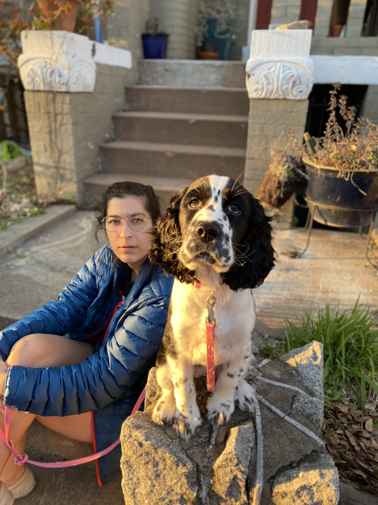

# Rachel Pizatella-Haswell

# About me 
Hi there. I'm a 2nd year PhD student at UC Berkeley's Goldman School of Public Policy. Prior to GSPP, I worked on impact evaluations focused on poverty alleviation, economic development and human rights, most recently at Innovations for Poverty Action. I have Master of Public Policy from GSPP and a Bachelor of Arts in Political Science and Religion from Duke University. Find my CV [here](Pizatella_CV.pdf). 

# Research  
My research lies at the intersection of social protection and financial inclusion with a focus on the design and delivery of social safety net programs that improve the lives of economically vulnerable populations in low-and-middle income countries.

## Emergency cash transfers, Philippines 
The Philippines Department of Social Welfare and Development (DSWD) has made it a priority to improve their Emergency Cash Transfer (ECT) program--unconditional cash assistance distributed to disaster-affected families. While evidence has demonstrated cash transfers’ welfare-enhancing effects, more evidence is required to understand the most effective program design features in disaster and climate affected environments. This project is a randomized controlled trial to test the impact of the timing of cash transfers, comparing anticipatory and reactionary approaches, on beneficiaries’ resilience. 
## Competition for transparency, Ghana
Most markets often lack transparency, a phenomenon that extends to markets for digital financial services (DFS)—particularly mobile money—which are characterized by uninformed consumers, shrouded attributes, and hidden prices. This lack of transparency can harm consumers and make the market inefficient, with implications for consumer protection and aggregate welfare. The project includes 5 pilot interventions to incentivize competition for price transparency by retail vendors in eastern Ghana. 

